  

 

  <b>toolkit</b>
    
  

 

  

  

 

  <picture>
    <source media="(prefers-color-scheme: dark)" srcset="https://raw.githubusercontent.com/Youmna148/Youmna148/gh-pages/github-contribution-grid-snake-dark.svg">
    <source media="(prefers-color-scheme: light)" srcset="https://raw.githubusercontent.com/Youmna148/Youmna148/gh-pages/github-contribution-grid-snake.svg">
    
  </picture>

 

  
  &nbsp;&nbsp;&nbsp;
  

 

  <code>learn → understand → build</code>

